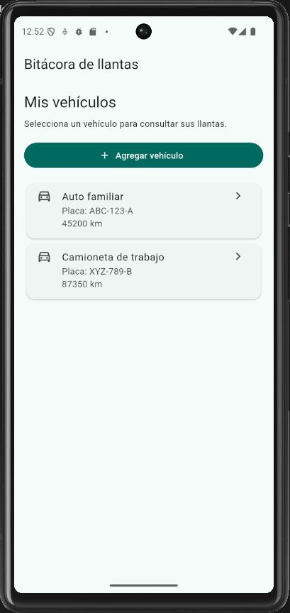
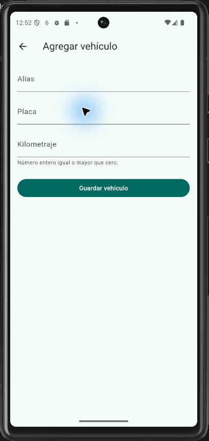
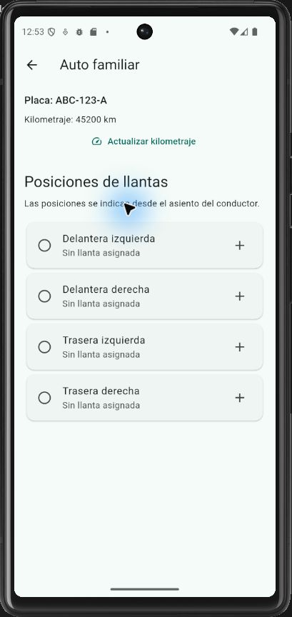

# Bitácora de llantas

Aplicación Flutter para registrar vehículos y consultar el recorrido de sus llantas.

## Funciones actuales

- Lista inicial con **Auto familiar** (ABC-123-A, 45200 km) y **Camioneta de trabajo** (XYZ-789-B, 87350 km).
- **Alta de vehículos:** alias, placa y kilometraje obligatorios. El kilometraje es un entero no negativo. Se eliminan espacios exteriores, la placa se guarda en mayúsculas y no se admiten placas repetidas sin distinguir mayúsculas.
- **Asignación de llantas:** toca una posición vacía y captura marca, modelo y kilometraje de instalación. Los tres campos son obligatorios; el kilometraje debe ser entero entre 0 y el actual del vehículo, incluidos ambos límites.
- Cada vehículo tiene cuatro posiciones independientes: delantera izquierda, delantera derecha, trasera izquierda y trasera derecha, vistas desde el asiento del conductor.
- **Actualización de kilometraje:** desde el detalle, ingresa un entero no negativo igual o mayor al kilometraje actual.
- **Recorrido por llanta:** se calcula como `kilometraje actual del vehículo - kilometraje de instalación`.
- Al volver a la lista y reabrir el detalle se conservan los cambios durante la sesión. Volver desde un formulario sin guardar no modifica los datos.

## Datos en memoria y límites

**Los datos todavía no se guardan entre sesiones.** Al reiniciar la aplicación (incluido un hot restart) se pierden los vehículos agregados, las asignaciones y los cambios de kilometraje; vuelven los dos vehículos de ejemplo con posiciones vacías.

No hay base de datos, API ni backend. Las posiciones ocupadas solo muestran información: aún no se pueden editar, retirar ni reemplazar llantas. La persistencia queda pendiente.

## Ejecutar en Android

Necesitas Flutter disponible en el PATH (con Dart compatible con `^3.13.4`, según `pubspec.yaml`), Android SDK y un emulador configurado en Android Studio o un teléfono con depuración USB autorizada.

Desde PowerShell, en la carpeta del proyecto:

```powershell
flutter doctor
flutter pub get
flutter emulators
```

Inicia un emulador desde Device Manager de Android Studio, o ejecuta lo siguiente sustituyendo `ID_DEL_EMULADOR` por un ID mostrado en el comando anterior:

```powershell
flutter emulators --launch ID_DEL_EMULADOR
flutter devices
```

Cuando aparezca como dispositivo Android, sustituye `ID_DEL_DISPOSITIVO` por el ID que devuelve `flutter devices` (por ejemplo, `emulator-5554`):

```powershell
flutter run -d ID_DEL_DISPOSITIVO
```

Para un teléfono físico, conéctalo por USB, autoriza la depuración y usa su ID en el mismo comando. Si `flutter doctor` indica licencias Android pendientes, ejecuta `flutter doctor --android-licenses` y revisa los términos. La primera compilación puede descargar dependencias y tardar varios minutos.

## Analizador y pruebas

Desde la raíz del proyecto:

```powershell
flutter analyze
flutter test
```

Las pruebas de widgets no requieren un emulador. Cubren alta y cancelación, validaciones, asignación independiente por posición y vehículo, conservación al navegar y actualización de kilometraje con recálculo del recorrido.

## Ejemplo de uso

1. Toca **Agregar vehículo**. Ingresa alias `Auto demo`, placa `DEMO-123` y kilometraje `58000`; pulsa **Guardar vehículo**.
2. Abre **Auto demo**, toca **Delantera izquierda** y captura marca `Marca demo`, modelo `Modelo A` e instalación `58000`. Pulsa **Guardar llanta**: el recorrido inicial será `0 km`.
3. Toca **Actualizar kilometraje**, escribe `65000` y pulsa **Guardar kilometraje**. La llanta mostrará `Recorridos: 7000 km`.
4. Regresa a la lista: el vehículo tendrá `65000 km`. Reabre su detalle para comprobar que conserva la llanta y el recorrido. Las otras tres posiciones siguen vacías.

Escribe los kilometrajes sin separadores de miles (por ejemplo, `65000`).

## Estado y navegación

La lista vive en el `State` de `VehiculosScreen`. Los formularios devuelven resultados con `Navigator.pop`: un vehículo, una llanta o un nuevo kilometraje. El detalle crea un vehículo actualizado conservando sus llantas y lo entrega a la lista mediante `onVehiculoActualizado`. `setState` reconstruye la pantalla; el recorrido se calcula al dibujar el detalle y no se guarda como un dato independiente.

## Flujo de Git

- `main`: versión integrada que pasó el análisis y las pruebas.
- Una rama por tarea: `feat/descripcion`, `fix/descripcion` o `docs/descripcion`.
- Commits pequeños con prefijos `feat:`, `fix:`, `docs:` o `test:`.
- Subir la rama y abrir un pull request hacia `main` con cambios y verificaciones; revisar antes de fusionar.
- Antes de la siguiente rama, actualizar `main` con `git pull --ff-only origin main`.

## Capturas reales

Capturadas en el emulador Pixel 6 con Android 16, ejecutando esta versión. Muestran el estado inicial; el ejemplo anterior explica cómo obtener el recorrido de 7000 km.

| Lista inicial | Alta de vehículo | Detalle y posiciones |
| --- | --- | --- |
|  |  |  |
